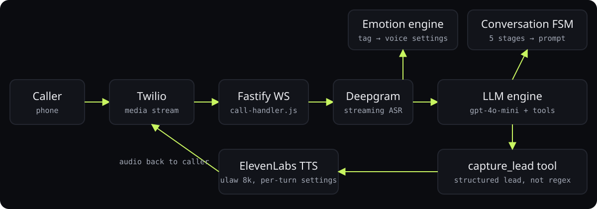

<div align="center">

# Emotion-aware AI dispatcher

**A phone agent that hears how the caller feels, adapts its voice, and captures the lead before hanging up.**

<p>
<a href="https://ibiraheel.com/p/receptionist-v2"></a>
</p>

<p>


</p>

</div>

<br>

> **Every call answered, every lead captured**  
> for Rapid Restore, a water-damage restoration company in Philadelphia

## What it did

Mike, the dispatcher, greets in under a second, tags the caller's emotion on every turn, moves through five conversation stages, and files the lead with a tool call.

<sub>Outcome: illustrative.</sub>

## How it works

<p align="center"></p>

1. Twilio media stream into Fastify over WebSocket; Deepgram streams speech to text.
2. The LLM must prefix every reply with [EMOTION:caller→agent][STATE:stage] tags; the parser strips them before TTS.
3. An emotion engine maps the tag to ElevenLabs voice settings (stability, style) per turn.
4. A conversation state machine feeds stage context into the prompt so the model asks one question at a time.
5. Lead capture is an OpenAI tool call, not regex over the transcript.

## Run it locally

```bash
cp .env.example .env   # Deepgram, OpenAI, ElevenLabs, Twilio
npm install
npm run dev            # Fastify on :5050
npm test
```

Expose the port (e.g. `ngrok http 5050`) and point your Twilio number's voice webhook at
`POST /incoming-call`; the call audio streams over the `/media-stream` WebSocket.

## Repository layout

```
├── src/
│   ├── prompts/
│   ├── routes/
│   ├── services/
│   ├── state/
│   ├── tools/
│   ├── utils/
│   ├── config.js
│   └── server.js
├── test/
│   └── unit/
└── package.json
```

---

<div align="center">

<sub>Built by <a href="https://github.com/ibi-raheel">Muhammad Ibrahim Raheel</a> · more work at <a href="https://ibiraheel.com">ibiraheel.com</a></sub>

</div>
